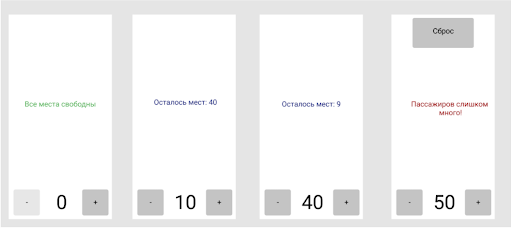

# PessengerCounter
Это приложение простой счётчик пассажиров для автобуса
## Описание задачи
* Нажатие кнопок «+» и «-» изменяет значение счётчика и тестовых полей на «+1» и «-1» соответственно. Задавать значение меньше 0 нельзя.
* Кнопка «Сброс» не только сбрасывает счётчик, но и возвращает приложение в первоначальное состояние (скриншот 1).
* В автобусе 49 сидячих мест. Мы хотим отправлять автобусы максимально наполненными, но допускать превышения нельзя. Слишком большое количество пассажиров — это повод для немедленного отправления.
* Если все места свободны, текст по середине — зелёный, кнопка «-» — недоступна.
* При количестве пассажиров от 1 до 49 текст синий, кнопки доступны. Кнопка «Сброс» невидимая.
* При количестве пассажиров 50 и выше текст красный, появляется кнопка «Сброс».
## Внешний вид
